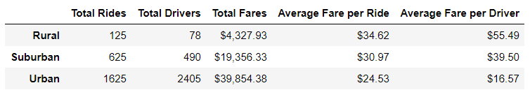
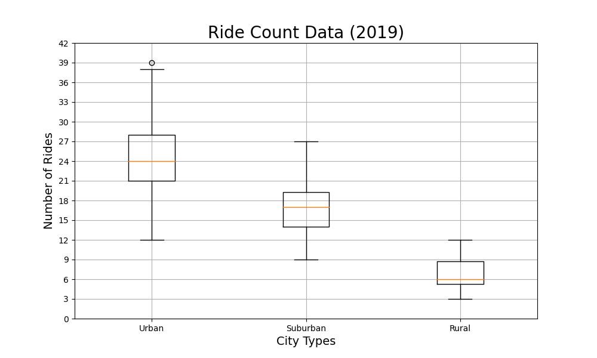
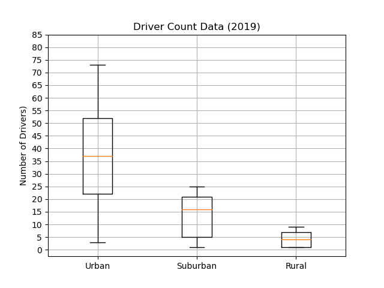
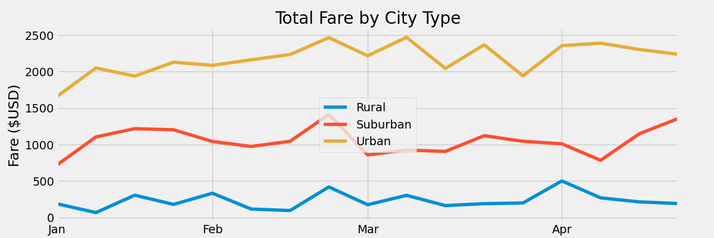

# PyBer_Analysis

## Overview

The purpose of this analysis is to evaluate differences in revenue drivers by city type (rural, suburban, urban). Revenue for a city is driven by the number of drivers, the number of rides per driver, and the fare per ride. It is reasonable to expect that these revenue drivers may differ by the type of city. A better understanding of these revenue drivers may be helpful in understanding how to improve overall profit. 

The study is based on ride-level data by city collected from January to early May 2019. The number of drivers by city and city type was collected from a different source that does not tie each ride to a specific driver. The data contains 120 cities, composed of 66 urban cities, 36 suburban cities and 18 rural cities.

## Results

A high-level breakdown of revenue by city type is shown in the chart below. Urban cities provide the most revenue for the company, followed by suburban and rural cities. But we see the inverse relationship for average fare per ride and average fare per driver. It appears that urban cities see a high volummne of short rides/fares, while suburban and rural markets have a much lower volume of longer rides/fares. The disparity in average fare per driver compared with average fare per ride raises a concern. Are urban drivers earning enough to keep them on board?

The following Box-and-Whisker plots show the distribution of data by city type for three revenue drivers: total number of rides in city by city type, total number of drivers in city by city type, and average fare for each city by city type.

The plot below compares the distribution of total rides by city type. Urban cities show the largest mean and variability in total rides, and rural cities show a substantially lower mean with less variability.

The following plot shows the distribution of the number of drivers by city type. This metric shows a pattern similar to the total rides data above. Urban cities show the largest mean and variability in number of drivers. Both suburban and rural cities show substantially lower means and variability.

The following plot of average fare shows less dramatic difference by city type than might be expected from the high-level summary chart above. The three distributions show substantial overlap.

The following plot of total weekly fare by city type shows a level of variability that may make city-level and driver-level planning difficult. For example, in urban cities, total weekly fares vary between $1,662 and $2,471. At an average fare of $24.53, that's a variation between 68 and 100 rides per week.

## Summary

 There is large variability in driver count and ride count for urban cities compared to rural and suburban. The same pattern is not observed in average fare, suggesting there may be distinct segments within urban cities. For example, there may be differences by size of urban city that would explain some of this variability.

Additionally, there is large disparity in average fare per driver; urban being substantially lower than rural and suburban. This raises the question of whether urban drivers are earning enough to keep them with Pyber. This disparity could be an artifact of the formula used for calculating average fare per driver, i.e. total urban fares / total urban drivers. Calculating the average using a lower level of aggregation may yield a different, more accurate result.
 
The analysis of revenue requires a companion analysis of costs to understand the drivers of overall profitability.

## Recommendations

* Evaluate the urban city segment to determine whether sub-segments provide a clearer picture of revenue patterns
* Investigate average fare per driver to determine whether action needs to be taken
* Perform an analysis of cost by city segment to assess profitability by segment